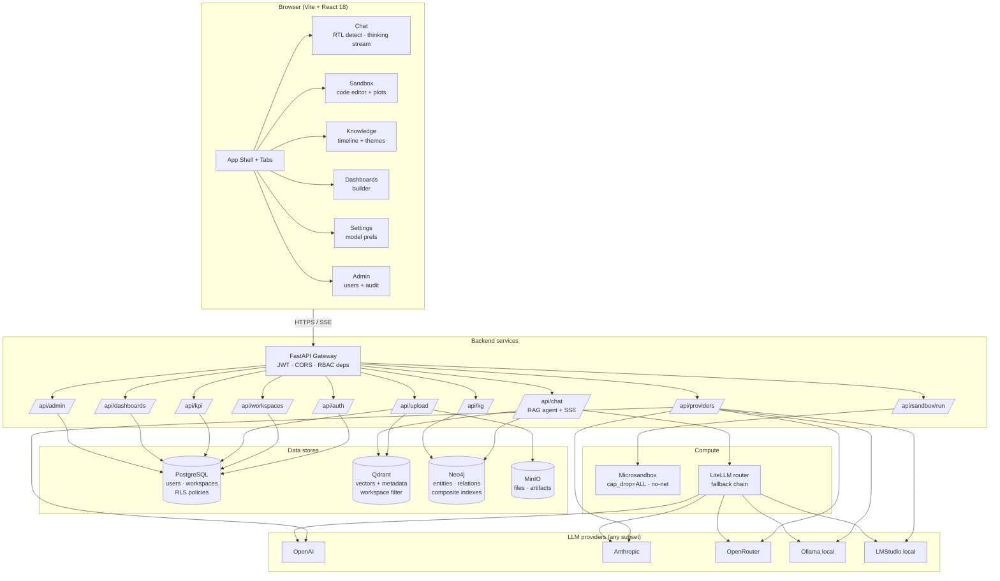
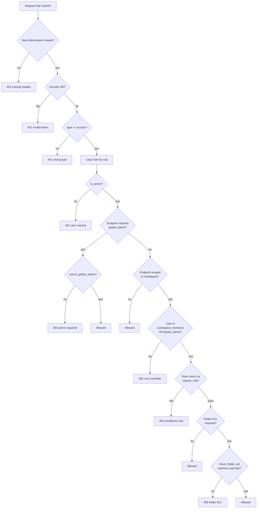
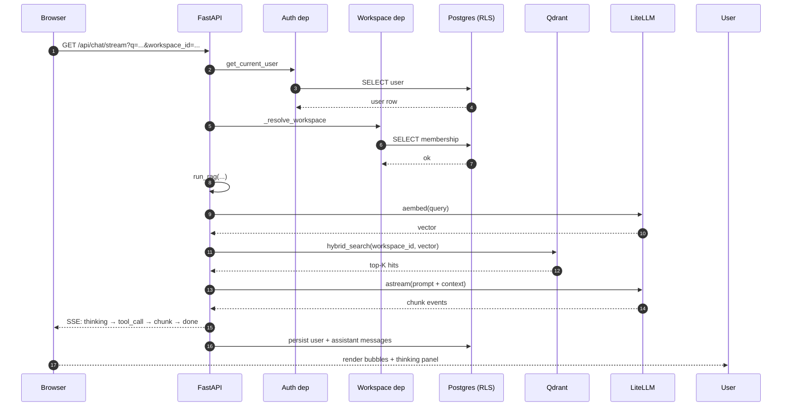
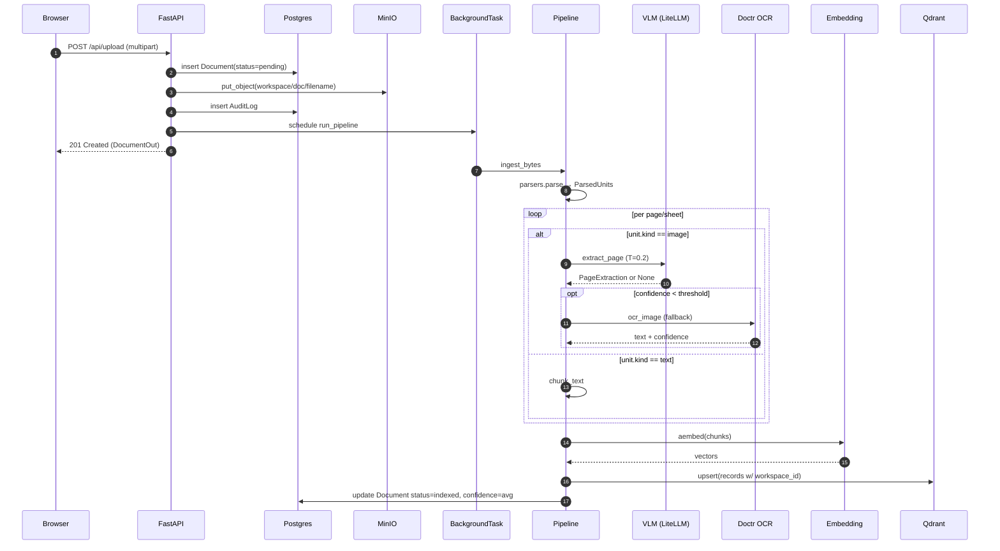
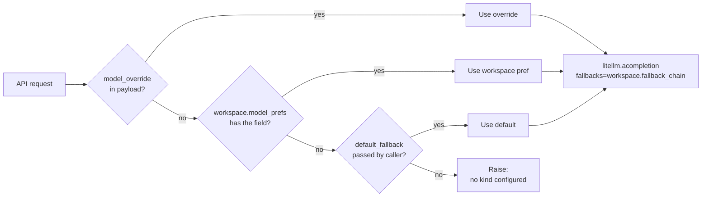
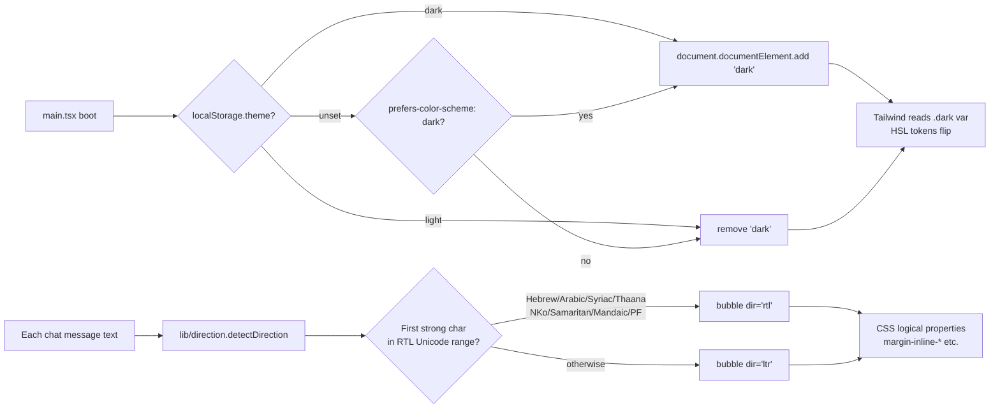

# Architecture

System topology, data ownership, and the security envelope. Diagrams render natively on GitHub via Mermaid.

---

## 1. Service topology

---

## 2. Data ownership matrix

| Store | Owns | Workspace-scoped? | RLS / filter |
|-------|------|-------------------|--------------|
| PostgreSQL | users, workspaces, members, folders, documents (rows), chat history, KPIs, dashboards, audit log, API keys | Yes (except `users`) | Postgres RLS via `app.current_workspace` session var |
| Qdrant | chunk vectors + payload (workspace_id, folder_id, document_id, text, metadata) | Yes | `workspace_id` filter is **mandatory** in every query |
| Neo4j | entities, events, locations, relationships | Yes | `workspace_id` property + composite indexes |
| MinIO | raw uploaded files, sandbox artifacts, exports | Yes | Object key prefixed with `<workspace_id>/<doc_id>/...` |

---

## 3. Auth + RBAC decision tree

Roles:
- `global_admin` — system-wide. CRUD users, workspaces, providers, audit log, impersonation.
- `workspace_admin` — within their workspace. Members, ACL, model prefs, quotas, dashboards, KPIs.
- `workspace_editor` — upload, chat, sandbox, KPI/dashboard create.
- `workspace_viewer` — read-only chat + dashboard view.

---

## 4. Request lifecycle (read path)

---

## 5. Request lifecycle (write path — upload + ingestion)

---

## 6. Security envelope

| Surface | Defense in depth |
|---------|------------------|
| Transport | HTTPS at the proxy; `Secure` cookies if you switch to cookie auth |
| Auth | JWT with `jti` nonce per token; bcrypt + sha256 pre-hash for passwords |
| AuthZ — table level | RLS on every workspace-scoped table, `FORCE ROW LEVEL SECURITY` so even superuser respects policies |
| AuthZ — application | `require_role`, `require_global_admin`, `check_folder_acl` decorators run before any business logic |
| Vector store | Mandatory `workspace_id` filter in `qdrant.hybrid_search`; client cannot omit it |
| Graph store | Every Cypher template includes `workspace_id`; relation types clamped to a fixed allowlist; no string interpolation of user-supplied values |
| Code execution | Microsandbox with `cap_drop=ALL`, `no-new-privileges`, `network=none`, `read_only`, tmpfs `/sandbox` + `/tmp`, mem/cpu quotas, timeout via `container.wait` + forced stop |
| LLM input | Aggregate before injection: > 100 hits → Neo4j theme aggregation, never raw chunks |
| LLM output | Pydantic v2 `strict=True, extra="forbid"` for VLM and KG extraction; retry once then fall back |
| KPI formulas | AST whitelist (no `eval`, no attribute access, no arbitrary calls); allowed funcs frozen at module level |
| File uploads | 100 MB hard cap, workspace quota check before write, MIME-typed parser dispatch |
| Audit | Every admin write + workspace mutation persists an `AuditLog` row; `/api/admin/audit` paginated query for review |

---

## 7. Configuration resolution order

The chat endpoint catches the "no model configured" exception and degrades to deterministic fallback so the UI keeps working.

---

## 8. Dark/light + RTL contract

