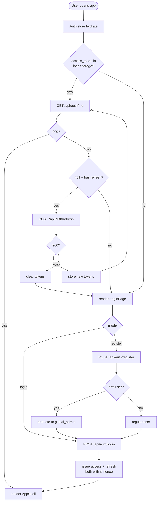
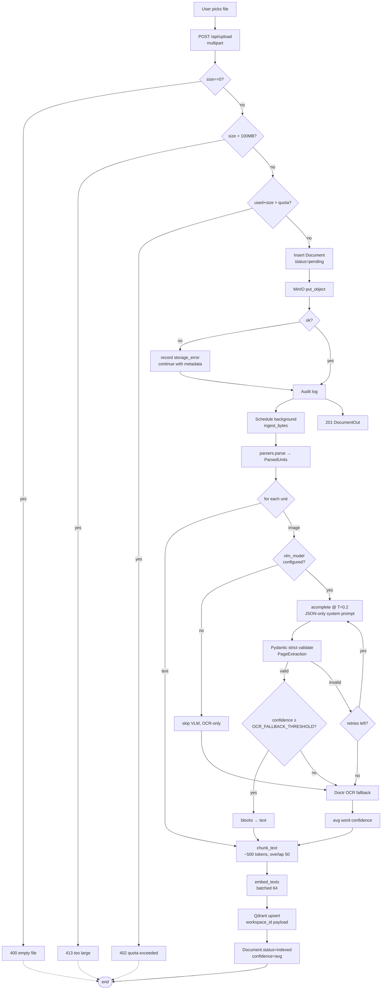
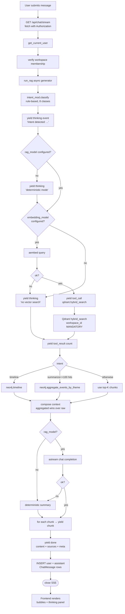
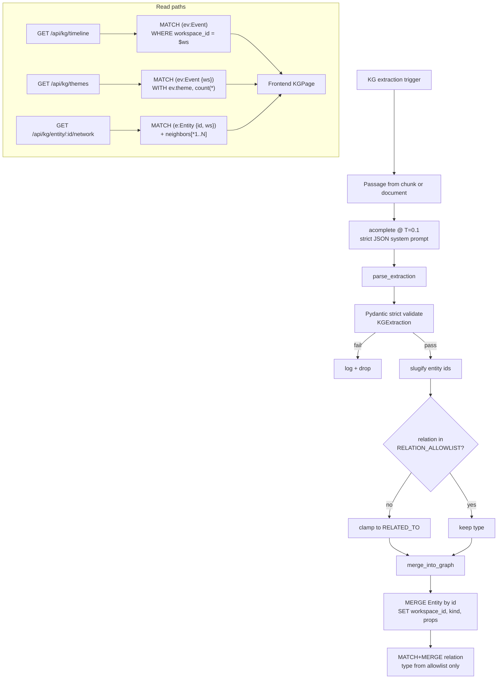
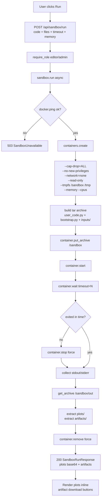
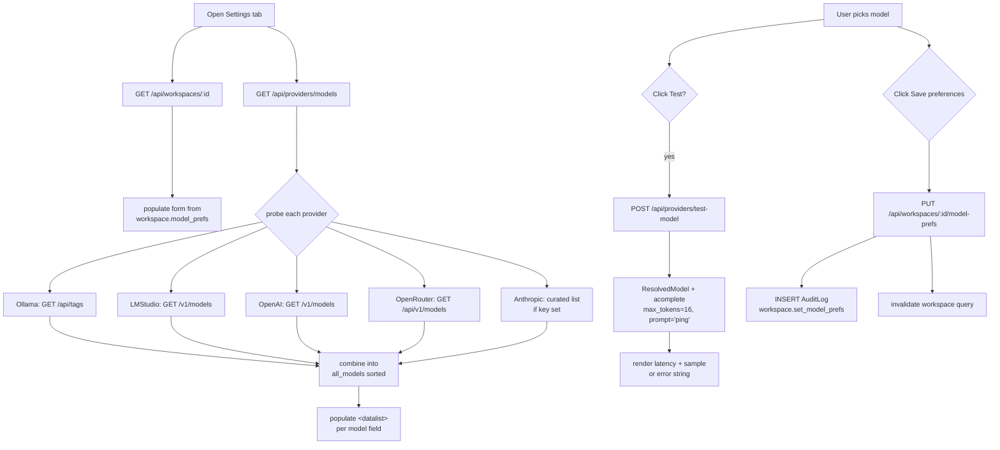
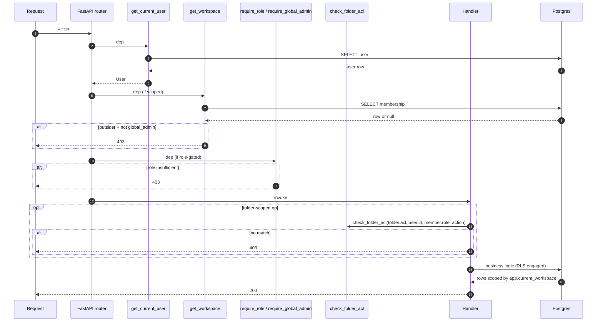

# Feature Flows

Per-feature flowcharts. Cross-reference with `ARCHITECTURE.md` for system topology.

---

## 1. Authentication & registration



---

## 2. Document ingestion (VLM + OCR fallback)



---

## 3. RAG chat with thinking stream



Event types yielded by `run_rag` and forwarded over SSE:

| Event | When | Frontend renders as |
|-------|------|---------------------|
| `thinking` | reasoning step | line in collapsible thinking panel |
| `tool_call` | retrieval/aggregation about to run | `→ name(args)` line in panel |
| `tool_result` | retrieval/aggregation finished | `← name: N result(s)` line |
| `chunk` | LLM streamed delta | append to assistant bubble |
| `done` | terminal success | freeze bubble, show sources |
| `error` | terminal failure | red ⚠ in bubble |

---

## 4. Knowledge graph extraction & query



---

## 5. Microsandbox execution



---

## 6. KPI definition & evaluation

```mermaid
flowchart TD
    Create[POST /api/kpi<br/>name+formula+filters+thresholds] --> Extract[_extract_variable_names]
    Extract --> SafeEval[evaluate_formula<br/>with sample={var: 1}]
    SafeEval --> SyntaxOk{ok?}
    SyntaxOk -- no --> R400[400 invalid formula]
    SyntaxOk -- yes --> Insert[INSERT custom_kpis<br/>+ AuditLog]

    subgraph AST["AST whitelist evaluator"]
        Parse[ast.parse mode=eval] --> Walk[Walk nodes]
        Walk --> Allow{node type in whitelist?}
        Allow -- BinOp/UnaryOp/Compare<br/>BoolOp/Constant/Name/IfExp --> Recurse[recurse]
        Allow -- Call --> Func{name in known_funcs?}
        Func -- min/max/sum/abs<br/>round/avg/sqrt --> Apply[apply func]
        Func -- otherwise --> R[FormulaError]
        Allow -- otherwise --> R
    end

    Eval[POST /api/kpi/evaluate] --> Layer1[validate_formula_shape<br/>Layer 1 type/syntax]
    Layer1 --> Layer2[validate_arithmetic_consistency<br/>Layer 2 div-by-zero/non-finite]
    Layer2 --> Layer3{cross_source provided?}
    Layer3 -- yes --> CrossLayer[validate_cross_source<br/>Layer 3 missing/unknown sources]
    Layer3 -- no --> Skip[skip Layer 3]
    CrossLayer --> RunEval
    Skip --> RunEval[evaluate_formula]
    RunEval --> Out[Return value + issues array]
```

---

## 7. Dashboard builder

```mermaid
flowchart LR
    Pick[Select dashboard<br/>or click + New] --> Layout[Center pane:<br/>render layout.widgets]
    Pick --> KPIs[Right pane:<br/>list KPIs + create form]

    KPIs --> Add{Click 'add to dashboard'}
    Add --> AppendW[append widget<br/>{id, type, kpi_id, title}]
    AppendW --> Put[PUT /api/dashboards/:id<br/>updated layout]
    Put --> Render[invalidate query → re-render]

    Layout --> Remove{Click × on widget}
    Remove --> Filter[filter widgets by id]
    Filter --> Put

    Layout --> Rename[Edit name inline]
    Rename --> Put

    Layout --> Delete[Click delete]
    Delete --> Confirm{confirm?}
    Confirm -- yes --> Del[DELETE /api/dashboards/:id]
    Del --> Render
```

---

## 8. Settings: live model wiring



---

## 9. RBAC enforcement (per-request)



---

## 10. End-to-end: a user asks a question

```mermaid
flowchart TD
    A[User types message] --> B{First strong char<br/>RTL range?}
    B -- yes --> C[Composer dir='rtl'<br/>logical CSS flips]
    B -- no --> D[Composer dir='ltr']
    C --> E[Click Send]
    D --> E
    E --> F[openChatStream<br/>fetch SSE]
    F --> G[run_rag yields events]
    G --> H[ThinkingStream panel<br/>updates per event]
    G --> I[Assistant bubble<br/>per-message RTL detection]
    H --> J[Done event<br/>sources [S1] [S2] rendered]
    I --> J
    J --> K[Persist conversation]
    K --> L([User sees answer])
```

---

## See also

- `INSTALL.md` — getting from zero to a running stack
- `ARCHITECTURE.md` — service topology and security envelope
- `../README.md` — feature spec, RBAC matrix, 500+ results strategy
