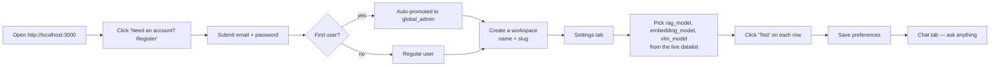

# Installation Guide

End-to-end setup for the Agentic RAG platform. Tested on Linux (Ubuntu 22.04+) and macOS. Windows users should run the infrastructure in WSL2.

---

## 1. Prerequisites

| Component | Minimum version | Why |
|----------|----------------|-----|
| Docker Engine | 24.x | Postgres, Qdrant, Neo4j, MinIO, Ollama, Microsandbox |
| Docker Compose | v2.20+ | `docker compose` CLI |
| Python | 3.11 | Backend (typed `match`, `StrEnum`, `datetime.UTC`) |
| Node.js | 20 LTS | Frontend build (Vite 5) |
| npm | 10.x | Comes with Node 20 |
| RAM | 16 GB | Neo4j (2 GB) + Ollama models + browser |
| Disk | 20 GB | Docker images, Qdrant, MinIO, Ollama models |
| OS | Linux / macOS | Sandbox uses cgroups; WSL2 works for dev |

Optional (production):
- A reverse proxy with TLS (Caddy / Nginx / Traefik)
- A managed Postgres (AWS RDS, Supabase, etc.) instead of the bundled container
- A LiteLLM-compatible LLM endpoint (OpenAI, Anthropic, OpenRouter, Ollama, LMStudio)

---

## 2. Clone and check out the branch

```bash
git clone https://github.com/yaafer86/Agentic_rag_chat.git
cd Agentic_rag_chat
git checkout claude/agentic-rag-platform-AMQMY   # or `main` once merged
```

---

## 3. Configure the environment

```bash
cp .env.example .env
```

Open `.env` and **at minimum** change:

```env
# Required — generate a long random secret
JWT_SECRET=$(openssl rand -hex 32)

# Required — Neo4j ships with a default password you must rotate
NEO4J_PASSWORD=<your-strong-password>

# Recommended — at least one LLM provider
OPENAI_API_KEY=sk-...
# or
ANTHROPIC_API_KEY=sk-ant-...
# or run Ollama locally — already configured at http://localhost:11434

# MinIO defaults are fine for dev; rotate for prod
MINIO_ACCESS_KEY=minioadmin
MINIO_SECRET_KEY=<your-minio-secret>
```

> **No model name lives in `.env`.** Models are picked per-workspace at runtime through the Settings page (`workspace.model_prefs`).

---

## 4. Start the infrastructure

```bash
cd infra
docker compose up -d postgres qdrant neo4j minio ollama
docker compose ps
```

Wait for the healthchecks (about 15 seconds). You should see:

```
NAME             STATUS
rag-postgres     Up (healthy)
rag-qdrant       Up
rag-neo4j        Up (healthy)
rag-minio        Up
rag-ollama       Up
```

Open these UIs to confirm:

| Service | URL | Login |
|---------|-----|-------|
| Neo4j Browser | http://localhost:7474 | `neo4j` / your password from `.env` |
| MinIO Console | http://localhost:9001 | `minioadmin` / your secret |
| Qdrant API | http://localhost:6333/dashboard | (no auth in dev) |
| Ollama API | http://localhost:11434/api/tags | (no auth) |

---

## 5. Backend — venv, deps, migrations, run

```bash
cd ../backend

# Create the venv
python3.11 -m venv .venv
source .venv/bin/activate          # Windows: .venv\Scripts\activate

# Install pinned deps (~2 minutes)
pip install --upgrade pip
pip install -r requirements.txt

# Apply schema migrations (creates tables + RLS policies on Postgres)
alembic upgrade head

# Smoke-test
pytest -q
# expected: 65 passed in ~25s

# Start the API server
uvicorn app.main:app --reload --port 8000
```

Open http://localhost:8000/docs for the live OpenAPI explorer.

> **Note:** in dev/SQLite mode the lifespan auto-creates tables. Against Postgres `alembic upgrade head` is mandatory — `init_db` is skipped on `dialect.name == 'postgresql'`.

---

## 6. Frontend — install + dev

In a second terminal:

```bash
cd frontend
npm install                         # ~45 seconds, ~700 packages
npm run typecheck                   # should print nothing (clean)
npm run dev
```

Open http://localhost:3000.

For a production build:

```bash
npm run build
# emits dist/ — serve with any static server
npm run preview
```

---

## 7. First-run setup

On first boot the database is empty. Walk through this order:



Concrete steps in the UI:

1. **Register the first account** — it becomes `global_admin` automatically. Anyone you create afterwards is a regular user.
2. **Create a workspace** via the picker in the top bar (`Acme` / slug `acme`).
3. **Settings tab** → fill in `rag_model`, `embedding_model`, optionally `vlm_model` and `agent_model`. The right panel shows which providers are reachable.
4. Click **Test** next to each model to confirm LiteLLM can reach it. You'll see latency + a sample reply.
5. Click **Save preferences**.
6. **Chat tab** → ask a question. With no documents uploaded, you get a fallback "no context retrieved" answer; that's expected.
7. **Upload a file** via the paperclip icon. The pipeline runs in the background: parse → VLM (if image/PDF) → chunk → embed → Qdrant.
8. Try chat again — answers now cite `[S1]`, `[S2]` from your document.

---

## 8. Production deployment notes

### Postgres
- Use a managed Postgres or a hardened container with backups.
- `alembic upgrade head` runs once at deploy; do **not** rely on `create_all`.
- The RLS migration `0002_rls` enables `ROW LEVEL SECURITY` and `FORCE ROW LEVEL SECURITY` on every workspace-scoped table.
- The backend sets `app.current_workspace` per request via the `session_scope()` context manager.

### Reverse proxy
- Terminate TLS at the proxy.
- Forward `/api/*` to the backend, everything else to the frontend.
- Set `APP_BASE_URL` and CORS to your real domain.

### Secrets
- Rotate `JWT_SECRET`, `NEO4J_PASSWORD`, `MINIO_*`. Store in your secret manager.
- LLM API keys live only in the backend env; never proxied to the browser.

### Microsandbox
- Production should run behind a separate Docker daemon with `userns-remap` enabled.
- Tighten `SANDBOX_MAX_MEMORY_MB`, `SANDBOX_TIMEOUT`, and per-workspace concurrency.
- The container is started with `cap_drop=ALL`, `no-new-privileges`, `network=none`, `read_only`, and `tmpfs` for `/sandbox` and `/tmp`. Do **not** soften any of these.

### Backups
- `pg_dump` for Postgres.
- `mc mirror` for MinIO.
- Qdrant snapshots via `POST /collections/rag_chunks/snapshots`.
- Neo4j: `neo4j-admin database dump`.

### Observability hooks (already wired)
- `/healthz` — liveness.
- `prometheus-fastapi-instrumentator` is in `requirements.txt`; mount the metrics endpoint when you wire P6.
- Sentry SDK is in `requirements.txt`; set `SENTRY_DSN` in env to activate.
- Frontend can be served with structured-logs sidecar if needed.

---

## 9. Troubleshooting

| Symptom | Cause | Fix |
|---------|-------|-----|
| `bcrypt password cannot be longer than 72 bytes` | passlib + bcrypt 4+ incompat | We use bcrypt directly with sha256 pre-hash. If you swap implementations, replicate the pre-hash in `app/core/security.py`. |
| `alembic.util.exc.CommandError: Can't locate revision identified by ...` | Database migrated past the code | `alembic stamp head` after rolling back the code, or pull the matching migration. |
| `no rag_model configured` in chat | `workspace.model_prefs.rag_model` is unset | Settings tab → fill the field → Save. The chat will still work in deterministic-fallback mode without it. |
| `KG unavailable: ...` on the Knowledge tab | Neo4j not reachable | `docker compose logs neo4j`. The default RAM heap is 512 MB; raise `NEO4J_server_memory_heap_max__size` if needed. |
| Sandbox returns 503 | Docker daemon unreachable from the backend | Run the backend on the same host as Docker, or mount `/var/run/docker.sock`. The endpoint contract returns 503 with a clear detail in this case. |
| Provider probe shows "unreachable" | API key missing/invalid or local Ollama not running | Settings panel shows the exact error string per provider. Set the env var and restart the backend. |
| `image:` not found / matplotlib not in sandbox | Custom sandbox image missing libs | The default `python:3.11-slim` only has `requirements-sandbox.txt` content. Bake your own image and set `SANDBOX_IMAGE`. |
| Chat stream stalls in browser | EventSource limitation | We use `fetch` streaming, not native EventSource, because EventSource can't carry `Authorization`. If you've fronted the backend with a proxy that buffers, disable buffering for `/api/chat/stream`. |
| RLS not isolating rows | Migration not run, or session not setting context | `alembic current` should show `0002_rls`. Check `app/core/db.py` `session_scope()` is used by the request handler. |

---

## 10. Where to read next

- `docs/ARCHITECTURE.md` — system topology and data-flow flowcharts.
- `docs/FLOWS.md` — per-feature flowcharts: auth, ingestion, RAG, KG, sandbox, KPI, dashboards, RBAC.
- `README.md` — feature spec, security envelope, AI-assisted development guidelines.
